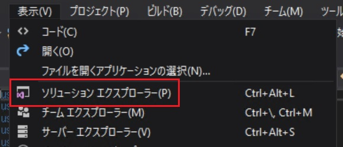
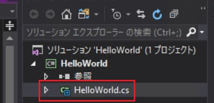

# Eclipse Script Wizardによるスクリプトの生成

## はじめてのスクリプト作成

初心者がスクリプトを開始する最も簡単な方法は、Eclipse Script Wizardを使用して、スクリプトの開発に使用できるVisual Studioプロジェクトを作成することです。  作成されたソースコードをテキストエディタで編集すれば、Visual Studioが導入されていない環境下でも開発を行うことが可能となります。  

本演習ではEclipse Script Wizardを使用して事前コンパイルが不要な「**Single File Plugin**」のソースコードテンプレートを生成し、簡単なメッセージウィンドウを表示させるスクリプトを作成します。

### 1. Eclipse Script Wizardの起動  

Windowsの[**スタート**]メニューから[**Eclipse Script Wizard**]メニュー項目を選択して、スクリプトウィザードを起動します。  


### 2. 生成するスクリプトテンプレートの設定  

Wizardの各欄を以下の通りに設定し、[**Create**]ボタンを押下して空のスクリプトテンプレートを生成して下さい。

- 「Name of the script」: HelloWorld
- 「Type of the script」: 「Single-file plug-in」
- 「Destination Location」： 「C:\Users\vms\Documents\Eclipse Scripting API\」


スクリプトファイルは以下の階層化されたフォルダ内に作成されます。  
<u> **Single File Plugin**タイプではスクリプトファイルがプロジェクトフォルダではなく、「plugin」フォルダに作成されるので注意してください。</u>


| ファイル名 | 種類 |
| :---- | :---- |
| HelloWorld.cs:| C#で記述されたスクリプトファイル |
| HelloWorld.csporj | C#のプロジェクトファイル |
| HelloWorld.sln | C#のソリューションファイル |

### 3. Visual Studioの起動  

Wizardでスクリプトを作成した場合、下記の様にVisual Studioの起動確認画面が表示されるので、[**Yes**]を選択します。


Visual Studioが起動したら、[**表示**]メニューから[**ソリューションエクスプローラー**]メニュー項目を選択して表示させます。



ソリューションエクスプローラー内の「**HelloWorld.cs**」をダブルクリックしてエディタ画面に表示させます。




### 4. コードを書こう!\

**Single File Plugin**タイプのスクリプトでは以下の関数**execute**内にコードを記述します。

```csharp
 public void Execute(ScriptContext context /*, System.Windows.Window window, ScriptEnvironment environment*/)
        {
            // TODO : Add here the code that is called when the script is launched from Eclipse.

        }
```

**MessageBox**クラスの**Show**メソッドを使用してメッセージウィンドウ(ダイアログボックスとも呼ばれます)を表示させます。**Show**メソッドは引数に渡されたテキスト「"Hello world in ESAPI."」を表示します。  

記述するコードは以下の通りです。  

```csharp
 MessageBox.Show("Hello world in ESAPI.");
```

コーディングが終了したら、保存します。保存する際にソリューションファイルを保存するウィンドウが開きますので、そのまま規定フォルダに保存します。

### 5. 作成したスクリプトの実行

**Eclipse**を起動し、[**External Beam Planning**]ワークスペースに切り替え、下記のテストプランを開きます。

- Patient ID：OOO
- plan ID：XXX

[**Tools**]メニューから[**Scripts**]メニュー項目を選択します。


スクリプトファイルの保管場所は次の2通りを選択可能です。

- 「**System Scripts**」: システム共通のデフォルトフォルダ
- 「**Folder**」: ログインユーザー指定の任意フォルダ

演習で作成したスクリプトファイルを実行するために、[**Location**]パネル内のラジオボタン[**Folder**]を選択し、続いて[Change Folder]を選択して下記フォルダを開きます。

- C:\Users\vms\Documents\Eclipse Scripting API\Plugins\


上欄に表示された「**HelloWorld.cs**」を選択し、[**Run**]ボタンを押下することでスクリプトを実行できます。
下図のようにメッセージウィンドウが表示されれば、
# **はじめてのスクリプトは成功です！**


