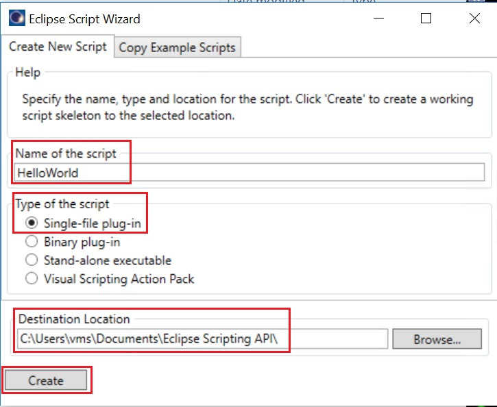

# Eclipse Script Wizardによるスクリプトの生成

## はじめてのスクリプト作成

初心者がスクリプトを開始する最も簡単な方法は、Eclipse Script Wizardを使用して、スクリプトの開発に使用できるVisual Studioプロジェクトを作成することです。作成されたソースコードをテキストエディタで編集すれば、Visual Studioが導入されていない環境下でも開発を行うことが可能となります。  

本演習ではEclipse Script Wizardを使用して事前コンパイルが不要な「**Single File Plugin**」タイプの簡単なメッセージウィンドウを表示させるスクリプトを作成します。

### 1. Eclipse Script Wizardの起動  

Windowsの[**スタート**]メニューから[**Eclipse Script Wizard**]メニュー項目を選択して、スクリプトウィザードを起動して下さい。  
<div align="center">

</div>

### 2. 生成するスクリプトの設定  

Wizardの各欄を以下の通りに設定し、[**Create**]ボタンを押下してスクリプトファイルを生成して下さい。

- 「Name of the script」： 「**HelloWorld**」
- 「Type of the script」： 「**Single-file plug-in**」
- 「Destination Location」： 「**C:\Users\vms\Documents\Eclipse Scripting API\\**」

<div align="center">

</div>

スクリプトファイルは以下の階層化されたフォルダ内に作成されます。  

<div align="center">

</div>

| ファイル名 | 種類 |
| :---- | :---- |
| HelloWorld.cs | C#で記述されたスクリプトファイル |
| HelloWorld.csproj | C#のプロジェクトファイル。プログラム単位でソースコードをまとめる。 |
| HelloWorld.sln | C#のソリューションファイル。複数のプロジェクト（プログラム）をまとめる。 |

「**Plugins**」フォルダには、スクリプト実行に使用されるC＃ソースコードが含まれています。このファイルは、任意のテキストエディターで開いて変更できます。  
「**Projects**」フォルダには、プロジェクトファイルを格納するプロジェクト名を持つ別のフォルダーが含まれています。

<u> **Single File Plugin** タイプではスクリプトファイルが「**Projects**」フォルダではなく、「**Plugins**」フォルダに作成されるので注意してください。</u>

### 3. Visual Studioの起動  

Wizardでスクリプトを作成した場合、下記の様にVisual Studioの起動確認画面が表示されるので、[**Yes**]を選択します。

<div align="center">

</div>

Visual Studioが起動したら、[**表示**]メニューから[**ソリューションエクスプローラー**]メニュー項目を選択して表示させます。

<div align="center">

</div>

[**参照**]セクションを展開し、このプロジェクトに追加された以下のEclipse Scripting API用アセンブリを確認します。

- VMS.TPS.Common.Model.API
- VMS.TPS.Common.Model.Types

これらのファイルは、スクリプト作成ウィザードによって自動的に参照へ追加され、プロジェクトをビルドしたり、Visual StudioのIntelliSense機能を使用するために必要です。Script wizardを使用せずにスクリプトを作成した場合は、手動で参照付けする必要があります。

<div align="center">

</div>

ソリューションエクスプローラー内の「**HelloWorld.cs**」をダブルクリックしてエディタ画面に表示させます。

<div align="center">

</div>

ソースコードでもアセンブリファイルが自動的に参照付けされていることを確認します。  

<div align="center">

</div>

### 4. コードを書こう!

**Single File Plugin** タイプのスクリプトでは **Execute** メソッドが実行されます。
このときにパラメータとして渡される**context** はインスタンス化されたクラスオブジェクト **ScriptContext** であり、実行中のEclipseインスタンスのコンテキストです。
コンテキストはプログラム（Eclipse）の状況（状態）、つまりスクリプト実行時の状態を指し、このコンテキストからEclipseのプランや輪郭、線量情報などへアクセスすることができます。  

```csharp
 public void Execute(ScriptContext context /*, System.Windows.Window window, ScriptEnvironment environment*/)
        {
            // TODO : Add here the code that is called when the script is launched from Eclipse.
        }
```

**MessageBox** クラスの **Show** メソッドを使用してメッセージウィンドウ(ダイアログボックスとも呼ばれます)を表示させます。**Show** メソッドは引数に渡されたテキスト「"Hello world in ESAPI."」を表示します。  

記述するコードは以下の通りです。  

```csharp
 MessageBox.Show("Hello world in ESAPI.");
```

コーディングが終了したら、保存します。保存する際にソリューションファイルを保存するウィンドウが開きますので、そのまま規定フォルダに保存します。

### 5. 作成したスクリプトの実行

**Eclipse** を起動し、[**External Beam Planning**]ワークスペースに切り替え、適当なプランを開きます。

[**Tools**]メニューから[**Scripts**]メニュー項目を選択します。

<div align="center">

</div>

スクリプトファイルの参照場所は次の2通りを選択可能です。

- 「**System Scripts**」: システム共通のデフォルトフォルダ
- 「**Folder**」: ログインユーザー指定の任意フォルダ

演習で作成したスクリプトファイルを実行するために、[**Location**]パネル内のラジオボタン[**Folder**]を選択し、続いて[Change Folder]を選択して下記フォルダを開きます。

- C:\Users\vms\Documents\Eclipse Scripting API\Plugins\

<div align="center">

</div>

上欄に表示された「**HelloWorld.cs**」を選択し、[**Run**]ボタンを押下することでスクリプトを実行できます。
下図のようにメッセージウィンドウが表示されれば、はじめてのスクリプトは成功です。

<div align="center">

</div>

---

# **ようこそ、ESAPIの世界へ!!!**  # {: align="center"}

---
