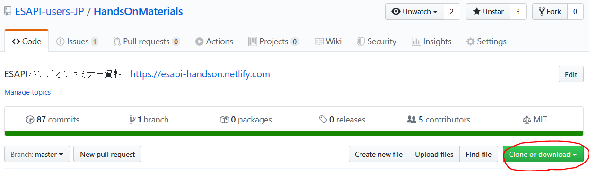
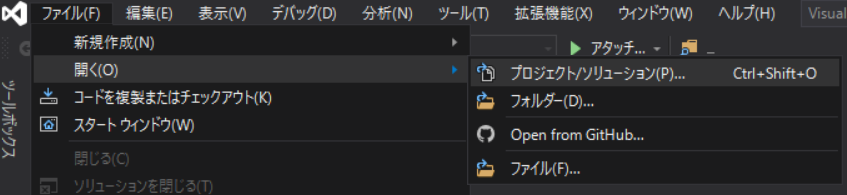
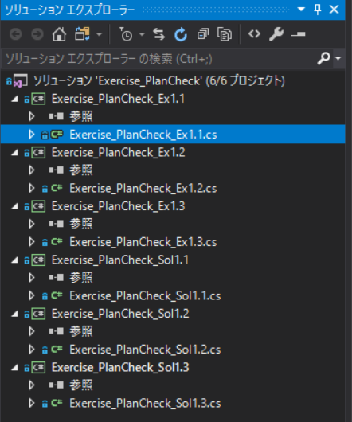
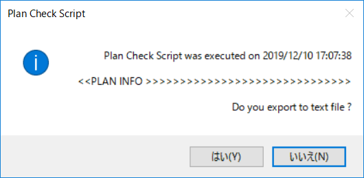

# 3.0 演習用ソースコードの確認

本セミナーは、ある程度まで準備された演習用のソースコードに追記して行く形で実習を進めます。

## ソースコードのダウンロード

まずはソースコードのダウンロードを行いましょう。
本Webページ右上のアイコンをクリックし、ソースコードが管理されているGitHubのリポジトリへ移動します。


続いて、移動先のページの ==Clone or Download== より ==Download ZIP== を選択し、ローカル環境にダウンロードします。



ダウンロードしたZIPファイルを展開すると、以下のようなフォルダ構成になっています。

```python
HandsOnMaterials-master/  
┣ Ex1_PlanCheck/  # 本演習で使います  
┣ Ex2_DataMining/  # 今回は使いません  
┣ docs/  # 演習用Document  
┣ ...  # その他ファイル  
```

続いて、今回使用する `Ex1_PlanCheck`フォルダの構成も確認しておきます。

```python
Ex1_PlanCheck/
┣ Ex.1.1/  # セクション3で使用
┣ Ex.1.2/  # セクション4, 5で使用
┣ Ex.1.3/  # セクション6から9で使用
┣ Sol.1.1/  # Ex.1.1の実装例
┣ Sol.1.2/  # Ex.1.2の実装例
┣ Sol.1.3/  # Ex.1.3の実装例
┗ Exercise_PlanCheck.sln  # Visual StudioのSolution
```

`Ex.1.x`が実際にコードを追記していくためのフォルダで、それに対応する実装例が記述済みのものが`Sol.1.x`になります。

`Exercise_PlanCheck.sln`はVisual Studioで使用されるソリューションファイル（後述）となっています。

## Visual Studioでソリューションを開く

では、Visual Studioで演習用コードを開いてみましょう。



先ほど展開した、**HandsOnMaterials-master** フォルダの中にある、**Ex1_PlanCheck/Exercise_PlanCheck.sln** を選択してください。

セキュリティ警告が表示される可能性がありますが、そのままOKしてください。

ソリューションエクスプローラは、以下のような表示になるはずです。



このなかから、`Exercise_PlanCheck_Ex1.1.cs`をダブルクリックし、コードを開いてください。  
ズラズラとすでにコードが書かれています。


!!! note "Visual Studioの管理構造"
    Visual Studioでは、ソースコードなどが記述されるプログラム類があり、それらをまとめる ==プロジェクト==、さらに複数のプロジェクトをまとめる ==ソリューション== という構造でデータが管理されています。  
    詳細は以下のリンクなどが参考になります。  
    https://www.atmarkit.co.jp/ait/articles/1704/21/news018_2.html 


## EclipseでEx.1.1を実行してみる

EclipseのExternal Beam Planningにて、ID: **ESAPI-001** の コース: **C1**、プラン: **1-1** を開いてください。

ひとまず、何も記述せずに **Ex.1.1** フォルダ内にあるScriptを実行してみましょう。
以下のように表示されたでしょうか？



現在記述されているコードは、Scriptの実行した日時、および結果をテキストファイルに出力するか確認する部分が実装されています。

## ソースコードを確認してみる

現在、Visual Studioでは`Exercise_PlanCheck_Ex1.1.cs`というファイルが開かれているかと思います。

このファイル中の62行目をご確認ください。

```csharp
messageText += GetPlanInfo(plan);
```

と記述されています。

ここでは、`GetPlanInfo`という関数（メソッド）に`plan`という引数を渡して、その結果を`messageText`に追加する、という処理を行っています。

では、`GetPlanInfo`関数の中身を少し見てみましょう。`GetPlanInfo`へカーソルを合わせ、++f12++ キーを押すと、その定義場所へジャンプします。  
(ちなみに、++ctrl+minus++ を押せば元の位置に戻ります)

定義は以下のようになっています。

```csharp
static string GetPlanInfo(PlanSetup plan)
{
    //Initializes the variables
    string oText = "";

    // Add here the code to get plan/patient information

    return oText;
}
```

ここで、関数の **引数** と呼ばれるのが`PlanSetup plan`です。
関数内では渡された引数をもとにデータを処理し、処理した結果を **返り値** として呼ばれた場所へ返します。  
この関数では、`oText`という文字列が返却されています。  
また、関数の型は、返り値の型と一致している必要があります。(`static`はひとまず気にしなくてOKです。)

次項では、この中に新しい項目を表示するためのプログラムを書いていこうと思います。