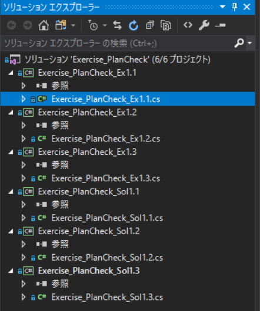

# 3.1 患者情報の取得

## 目的

Eclipse上で開いているプランに対して、

- 患者ID
- 患者名

を取得し、表示する。

## 必要な情報

患者ID、患者名

## 与えられている引数

`PlanSetup`クラスのインスタンス`plan`

## 必要な情報へのアクセス方法

現在開いているプランから患者情報へアクセスするには、以下のようにします。

```csharp
// Patientクラスのインスタンス取得
var patient = plan.Patient;

// IDの取得
var patientId = patient.Id;

// 名前の取得
var patientName = patient.LastName + " " + patient.FirstName;
```

### 患者を開く

EclipseのExternal Beam Planningにて、ID: **ESAPI-001** の コース: **C1**、プラン: **Plan1** を開いてください。

### コードをVisual Studioで開く

まずは、Visual Studioで演習用コードを開きます。


デスクトップにある、**HandsOnMaterials** フォルダの中にある、**Ex1_PlanCheck/Exercise_PlanCheck.sln** を選択してください。

ソリューションエクスプローラは、以下のような表示になるはずです。



このなかから、`Exercise_PlanCheck_Ex1.1.cs`をダブルクリックし、コードを開いてください。  
ズラズラとすでにコードが書かれています。

ひとまず、何も記述せずに **Ex.1.1** フォルダ内にあるScriptを実行してみましょう。
以下のように表示されたでしょうか？


現在記述されているコードは、Scriptの実行時間および結果をテキストに出力するか確認する部分が実装されています。

ここに、患者情報を追加するためのコードを記述しましょう。

## 実装

コードは、`Exercise_PlanCheck_Ex1.1.cs`の中の`GetPlanInfo`関数の中に記述します。

!!! note "関数の引数と返り値、型"
    `GetPlanInfo`関数は、以下のように記述されています。
    ```csharp
    static string GetPlanInfo(PlanSetup plan)
    {
        string oText = "";
        ~~省略~~
        return oText; 
    }
    ```
    ここで、**引数** と呼ばれるのが`PlanSetup plan`です。
    関数内では渡された引数をもとにデータを処理し、処理した結果を **返り値** として呼ばれた場所へ返します。  
    この関数では、`oText`という文字列が返却されています。  
    また、関数の型は、返り値の型と一致している必要があります。(`static`はひとまず気にしなくてOKです。)

では、この関数の中の`return oText`の前に以下を追加しましょう。

```csharp
// Patientクラスのインスタンス取得
var patient = plan.Patient;

// IDの取得
var patientId = patient.Id;

// 名前の取得
var patientName = patient.LastName + " " + patient.FirstName;

oText += string.Format("ID:{0}, Name:{1}\n", patientID, patientName);
```

ではこれを実行してみてください。  
患者ID、氏名が表示されればOKです。

!!! note "文字列の結合"
    文字列の結合は、単純に`string + string`で可能です。  
    また、ある文字列の中に変数を埋め込む際は、上記のように`string.Format()`を使用することができます。
