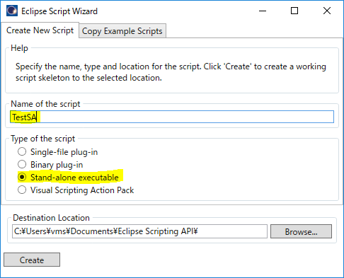
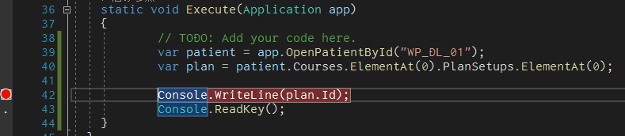
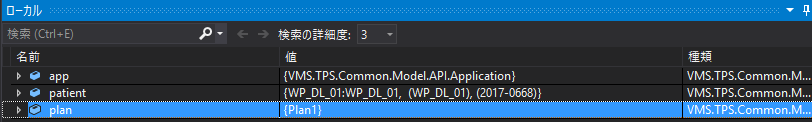

# 3.3 StandAlone exeによるデータの確認

## Eclipse Script WizardからStand Alone exeを作成

下図のように、**TestSA** という名前のStand-alone executableを作成します。



作成後、そのままVisual Studioを開いていただいてOKです。  
(2つめのVSのWindowが立ち上がります)

### TestSA.csを編集

Visual Studioのソリューションエクスプローラより、`TestSA.cs`をダブルクリックして表示します。

36行目付近に`Execute`関数がありますので、この中に以下のコードを記述してください。

```csharp
var patient = app.OpenPatientById("ESAPI-001");
var plan = patient.Courses.ElementAt(0).PlanSetups.ElementAt(0);

Console.WriteLine(plan.Id);
Console.ReadKey();
```

その後、Visual Studioの画面上部にある **開始** ボタンをクリックすると、黒い画面にプランIDが表示されます。  
この黒画面はキーボード入力待ちの状態なので、何かしらのキーをクリックすると終了します。

## Debugの実施

では、このプログラムの実行を途中で止めてみましょう。



この図のように、`Console.WriteLine`の行の左側のバーでクリックすると、赤丸が打たれます。  
この状態で再度開始ボタンをクリックすると、この直前でプログラム実行がストップし、**変数の中身に何が格納されているかを確認する** ことができます。



こうすることで、現在の変数（インスタンス）が持つプロパティとその中身、型などを確認し、さらにそれらの関係を知ることができます。  
ただし、ここではそれぞれのクラスが持つメソッド（関数）までは確認できませんので、ESAPI特有の関数などはやはりHelpを見る必要があります。

デバッグを止める場合は、Visual Studio上部の停止ボタン（赤い□）をクリックしてください。