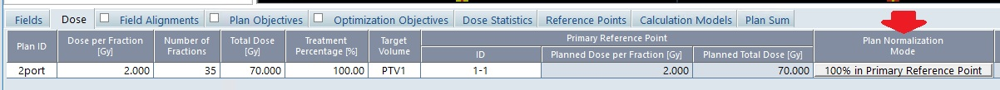

# 4.2 プランNormalizationのチェック

## 目的

プランの正規化が指定した方法であるかチェックします。

## 必要な情報

プランの正規化方法

## 与えられている引数

`PlanSetup`クラスのインスタンス`plan`

## 必要な情報へのアクセス方法

現在開いているプランからコースおよびプラン情報へアクセスするには、以下のようにします。

```csharp
string n_method = plan.PlanNormalizationMethod;
```

## 必要な情報の表示

`Exercise_PlanCheck_Ex1.2.cs`を開き、関数 **CheckPlanFunc** 内にコードを記述してみましょう。

```csharp
MessageBox.Show(string.Format("Plan normalization method: {0}", plan.PlanNormalizationMethod));
```

## 実装

本演習ではプランの正規化方法が下記に該当するかチェックする仕組みを作ります。  
planインスタンスのPlanNormalizationMethodプロパティで取得できるプラン正規化情報はEclipseのDoseタブに表示されている文字列になります。  



取得した文字列の中にモードごとの特異なキーワードが含まれているかで設定されている正規化方法を識別します。
(下図)

| 正規化モード | 表示文字列 | キーワード |
|:-------|:------|:------|
| Primary Reference Point | 100% Primary Reference Point | " Primary " |
| D50% | 100.00 % covers 50.00 % of Target Volume | " 100.00 % covers " および " 50.00 % of "|
| D95% | 100.00 % covers 95.00 % of Target Volume | " 100.00 % covers " および " 95.00 % of "|

### 文字/文字列を検索する

**String** クラスの **IndexOf** メソッドを使うことで文字列内に含まれる文字/文字列の位置を取得することができます。引数は検索する文字もしくは文字列を指定します。指定した文字/文字列が見つかった場合は、0から始まるインデックス番号を返し、見つからなかった場合は-1を返します。したがって戻り値が0以上なら検索文字列が含まれていると判定します
。

- Primary Reference Pointの場合

```csharp
if (n_method.IndexOf("Primary") >= 0)
{
    ～～処理～～
}
```

D50%およびD95%は論理演算子を組み合わせることで下記のように一行に収めることができます。  
（見やすさの観点から改行して2行表示にしています。）

- D50%/D95%の場合

```csharp
if (((n_method.IndexOf("100.00% covers") >= 0)
    && ((n_method.IndexOf("95.00% of") >= 0) || (n_method.IndexOf("50.00% of") >= 0))) == true)
{
    ～～処理～～
}
```

`Exercise_PlanCheck_Ex1.2.cs`を開き、**CheckPlanFunc** 内の次の1行のコメントを解除します。

```csharp
//checkName = "Plan normalization method";
```

関数 **CheckPlanFunc** 内の下記部分にコードを記述しましょう。  

```csharp
// Check plan normalization method.
checkName = "Plan normalization method";

　～～以下にコードを記述～～
```

記述するコードは以下の通りです。

```csharp
string n_method = plan.PlanNormalizationMethod;
//if ((n_method.IndexOf("No plan normalization") >= 0) ||
//(n_method.IndexOf("Plan Normalization Value") >= 0))

if (n_method.IndexOf("Primary") >= 0)// set primary reference point
{
    // If true, add text[O] to the string 
    oText += MakeFormatText(true, checkName, "");
}
else if (n_method.IndexOf("covers") >= 0)
{
    if (((n_method.IndexOf("100.00% covers") >= 0)
        && ((n_method.IndexOf("95.00% of") >= 0) || (n_method.IndexOf("50.00% of") >= 0))) == true)
    {
        // If true, add text[O] to the string 
        oText += MakeFormatText(true, checkName, "");
    }
    else
    {
        //If false, add the parameters and text[X] to the string 
        oText += MakeFormatText(false, checkName, n_method);
    }
}
else // other method (No plan normalization or Plan Normalization Value)
{
    //If false, add the parameters and text[X] to the string 
    oText += MakeFormatText(false, checkName, n_method);
}
```
