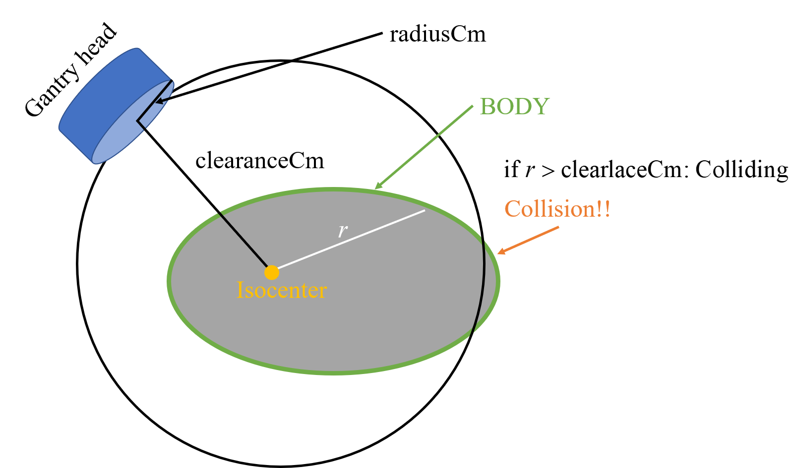
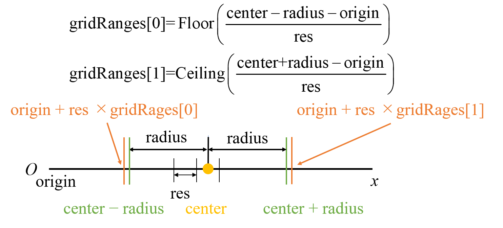

# 5.5 コリジョンのチェック

## 目的

体輪郭がガントリ・ヘッドに接触しないかの簡易的な確認。

ガントリ・ヘッドはアイソセンターからクリアランス分の距離離れた円盤と仮定。アイソセンターを通るG-T方向を中心軸としたクリアランス距離を半径とした円柱（長さ方向はアイソセンターの前後、円盤の半径分の広がりを持つとする）と体輪郭が交わらないかを判定する。

## 必要な情報

プランで用いられている画像、
体輪郭の`Structure`オブジェクト、
体輪郭の輪郭の座標点、
画像原点のz座標、
画像の体軸（z軸）方向のグリッド数（スライス数）、
グリッド幅（スライス厚）、
アイソセンタの座標

## 与えられている引数

なし

## 必要な情報へのアクセス方法
- 現在開かれているプランで用いられている画像の取得
  ```csharp
  var image = plan.StructureSet.Image;
  ```
- IDが`structureName`の`Structure`オブジェクトの取得
  ```csharp
  var structure = GetStructureFromId(structureName, plan);
  ```
  `plan`は`PlanSetup`オブジェクト、`GetStructureFromId`は補助的な関数
- スライス`i`における`sturcture`の輪郭(`VVector[][]`)の取得
  ```csharp
  contours = structure.GetContoursOnImagePlane(i)
  ```
  `contours`は`VVector[]`の配列。`VVector[]`が一つの輪郭に対応。
  1スライスに複数の輪郭がある可能性もある。
  一つ一つの`VVector`が輪郭の点に対応。
  
  詳しくは *6.3 リファレンスポイントと体表面のチェック* を参照。

- 画像の原点の取得
  ```csharp
  var origin = image.Origin
  ```
- 原点のz座標の取得
  ```csharp
  double zOrigin = image.Origin.z;
  ```
- 画像のz方向のグリッド数（スライス数）
  ```csharp
  int zSize = image.ZSize;
  ```
- 画像のz方向のグリッド幅（スライス厚）
  ```csharp
  double zRes = image.ZRes;
  ```
- アイソセンター（一番目のビームのアイソセンター）の取得
  ```csharp
  var iso = plan.Beams.First().IsocenterPosition
  ```
- アイソセンターの座標の取得
  ```csharp
  double xIso = plan.Beams.First().IsocenterPosition.x;
  double yIso = plan.Beams.First().IsocenterPosition.y;
  double zIso = plan.Beams.First().IsocenterPosition.z;
  ```



## 必要な情報の表示

- 画像ID
    ```csharp
    MessageBox.Show(string.Format("Image ID: {0}", image.Id));
    ```
- 画像の グリッド情報
    ```csharp
    MessageBox.Show(string.Format("Origin (原点): ({0:0}, {1:0}, {2:0})", image.Origin.x, image.Origin.y, image.Origin.z));
    MessageBox.Show(string.Format("Resolution (グリッド幅): ({0:0}, {1:0}, {2:0})", image.XRes, image.YRes, image.ZRes));
    MessageBox.Show(string.Format("Size (グリッドサイズ): ({0:0}, {1:0}, {2:0})", image.XSize, image.YSize, image.ZSize));
    ```
- アイソセンタ情報
    ```csharp
    MessageBox.Show(string.Format("Isocenter: ({0:0}, {1:0}, {2:0})", xIso, yIso, zIso));
    int k0 = (int)Math.Floor((xIso - image.Origin.x) / image.XRes);
    int j0 = (int)Math.Floor((yIso - image.Origin.y) / image.YRes);
    int i0 = (int)Math.Floor((zIso - image.Origin.z) / image.ZRes);
    MessageBox.Show(string.Format("Isocenterのグリッド位置: ({0:0}, {1:0}, {2:0}", k0, j0, i0));
    ```
- 調べるスライスの範囲
    ```csharp
    var iZmin0 = (int)Math.Floor(((zIso - radius) - zOrigin) / zRes);
    iZmin0 = (iZmin0 >= 0) ? iZmin0 : 0;
    var iZmax0 = (int)Math.Ceiling(((zIso + radius) - zOrigin) / zRes);
    iZmax0 = (iZmax0 < zSize) ? iZmax0 : zSize - 1;
    MessageBox.Show(string.Format("調べるスライスの範囲: {0:0}–{1:0}", iZmin0, iZmax0));
    ```

## 実装
- 体輪郭の名前の指定
  ```csharp
  string structureName = "BODY";
  ```
- ガントリヘッドの半径（`radiusCm`）、クリアランス距離（`clearanceCm`）の指定
  ```csharp
  // radius of the bottom of gantry head in cm
  double radiusCm = 50;
  // clearance of the gantry head in cm
  double clearanceCm = 50;
  ```
- 体輪郭の`Structure`オブジェクトを取得
  ```csharp
  var structure = GetStructureFromId(structureName, plan);
  ```
  ```csharp
  if (structure == null)
  {
      oText += MakeFormatText(false, checkName, String.Format("No structure: {0}", structureName));
  }
  else
  {
      //radius in mm
      var radius = radiusCm * 10;

      //clearance in mm
      var clearance = clearanceCm * 10;
  ```
- アイソセンタの座標の取得
  ```csharp
      var image = plan.StructureSet.Image;
      double zOrigin = image.Origin.z;
      int zSize = image.ZSize;
      double zRes = image.ZRes;
      double xIso = plan.Beams.First().IsocenterPosition.x;
      double yIso = plan.Beams.First().IsocenterPosition.y;
      double zIso = plan.Beams.First().IsocenterPosition.z;
  ```
- z軸方向にチェックしなければならないスライスの範囲を取得 
  ```csharp
      var zRange = GetGridRange1d(radius, zIso, zOrigin, zRes, zSize);
  ```
- 衝突する点のz座標の配列
  ```csharp
      var zCollisions = new List<double>();
      for (int i = zRange[0]; i <= zRange[1]; i++)
      {
          double z = zOrigin + i * zRes;

          // if i goes out of image, the boundary image is used
          VVector[][] contours;
          if (i < 0)
          {
              contours = structure.GetContoursOnImagePlane(0);
          }
          else if (i >= zSize)
          {
              contours = structure.GetContoursOnImagePlane(zSize - 1);
          }
          else
          {
              contours = structure.GetContoursOnImagePlane(i);
          }

          bool doesCollide = false;
          foreach (var contour in contours)
          {
              if (doesCollide)
              {
                  break;
              }            
              foreach (var point in contour)
              {
  ```
- 衝突の判定
  ```csharp
                  double r = Math.Sqrt(Math.Pow(point.x - xIso, 2) + Math.Pow(point.y - yIso, 2));
                  if (r >= clearance)
                  {
                      doesCollide = true;
                      zCollisions.Add(z);
                      break;
                  }
              }
          }
      }

      if (zCollisions.Count == 0)
      {
          oText += MakeFormatText(true, checkName, "");
          //   return "No collision";
      }
      else
      {
          // string collisionResult = "Collision check:";
  ```
- 衝突する範囲の出力
  ```csharp
          double x = image.Origin.x;
          double y = image.Origin.y;
          double zFirst = zCollisions.First();
          double zLast = zCollisions.Last();

          var zFirstUcs = (image.DicomToUser(new VVector(x, y, zFirst), plan)).z;
          var zLastUcs = (image.DicomToUser(new VVector(x, y, zLast), plan)).z;
          string collisionResult = string.Format("\n{0} collides with gantry between z = {1:0.00} and {2:0.00} cm", structureName, zFirstUcs / 10, zLastUcs / 10);

          oText += MakeFormatText(false, checkName, collisionResult);
      }
  }
  ```
- `PlanSetup`と`Structure`のIDから`Structure`オブジェクトを取得する補助関数
  ```csharp
  public static Structure GetStructureFromId(string id, PlanSetup planSetup)
  {
      string structureId = id;
      var query = planSetup.StructureSet.Structures.Where(s => s.Id == structureId);
      if (query.Count() != 1)
      {
          return null;
      }
      return query.Single();
  }
  ```
- z軸方向にチェックしなければならないスライスの最初と最後のインデックスを返す補助関数 
  ```csharp
  public static int[] GetGridRange1d(double radius, double center, double origin, double res, int size)
  {
      var gridRanges = new int[2];

      gridRanges[0] = (int)Math.Floor(((center - radius) - origin) / res);
      if (gridRanges[0] < 0)
      {
          gridRanges[0] = 0;
      }
      gridRanges[1] = (int)Math.Ceiling(((center + radius) - origin) / res);
      if (gridRanges[1] >= size)
      {
          gridRanges[1] = size-1;
      }

      return gridRanges;
  }
  ```
  
  