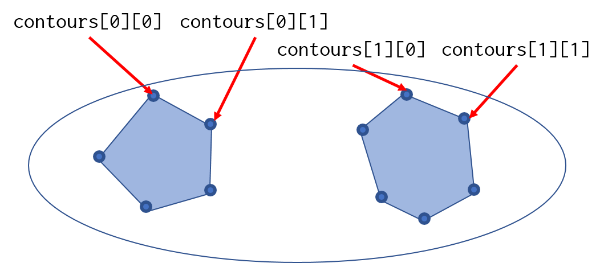

# 6.3 リファレンスポイントと体表面のチェック

## 目的

Primary Reference Pointと、体表面の距離が規定値より近接してないかをチェックします。

## 必要な情報

Primary Reference Pointの座標、体表面輪郭の座標

## 与えられている引数

`PlanSetup`クラスのインスタンス`plan`

## 必要な情報へのアクセス方法

Primary Reference Pointへのアクセスは以下の通りです。
`ReferencePoint`クラスのインスタンスを返します。

```csharp
var refPoint = plan.PrimaryReferencePoint;
```

Eclipse v15以降の場合、以下のように扱うことが可能です。

```csharp
// Reference Pointが座標を持つかどうか判定する
if (plan.PrimaryReferencePoint.HasLocation(plan))
{
    // Reference Pointの座標を取得する
    var refPointLocation = plan.PrimaryReferencePoint.GetReferencePointLocation(plan);
}
```

座標は **VVector** 構造体で得ることができます。

v13の場合、`ReferencePoint`クラスは`HasLocation`メソッドや`GetReferencePointLocation`メソッドを持っていません。  
代わりに、`FieldReferencePoint`クラスに`RefPointLocation`プロパティがあるので、例えば以下のようにアクセスすることができます。

```csharp
// Primary Reference PointのIDを取得
var prfId = plan.PrimaryReferencePoint.Id;
// Reference Pointのリストを取得
var refPoints = plan.Beams.ElementAt(0).FieldReferencePoints;
// IDがPrimaryと一致するものを選択
var primary = refPoints.First(r => r.Id == prfId);
// 座標の取得
var refPointLocation = primary.RefPointLocation;
```

続いて、体輪郭のStructureの取得を行います。

```csharp
// StructureSetの取得
var ss = plan.StructureSet;
// DICOM typeがExternalのStructureを取得
var body = ss.Structures.First(s => s.DicomType == "EXTERNAL");
```

輪郭点の取得

```csharp
// まずCT画像の枚数を調べる
var z = ss.Image.ZSize;

// 各スライスの座標点を取得
for (int i = 0; i < z; i++)
{
    var contours = body.GetContoursOnImagePlane(i);
    // そのスライスに輪郭点がある場合
    if (contours.Length != 0)
    {
        // 1スライスの中の輪郭情報を順番に取得
        // 1スライスに2つ以上輪郭がある可能性があるので
        foreach (var contour in contours)
        {
            // 輪郭点 (VVector) を順番に取得
            foreach (var point in contour)
            {
                ~~ 処理を記述 ~~
            }
        }
    }
}
```

## 必要な情報の表示

まずは、Primary Reference Pointの座標を表示してみましょう。

```csharp
// PrimaryReferencePointを取得
var refPoint = plan.PrimaryReferencePoint;
// 座標の取得
var location = refPoint.GetReferencePointLocation(plan);
// 表示
MessageBox.Show(string.Format("x: {0:f2}, y: {1:f2}, z: {2:f2}", location.x, location.y, location.z));
```

続いて、輪郭点情報の表示です。
順番に見ていきましょう。

```csharp
// Structure setの取得
var ss = plan.StructureSet;
var body = ss.Structures.Single(s => s.DicomType=="EXTERNAL");

// 画像情報の取得
var image = ss.Image;
var zSize = image.ZSize;  // スライス枚数
var zRes = image.ZRes;  // スライス間隔
var originZ = image.Origin.z;  // z方向のスタート地点

// 任意のスライス位置を指定
double zPos = 0.0;
var index = (int)((zPos - originZ) / zRes); // 何番目のスライスか取得

// 輪郭情報を取得
var contours = body.GetContoursOnImagePlane(index);
var point = contours[0][0]; // 最初の輪郭点

MessageBox.Show(string.Format("x: {0:f2}, y: {1:f2}, z: {2:f2}", point.x, point.y, point.z));
```

`GetContoursOnImagePlane`について補足しておきます。  
このメソッドは、スライス番号を整数で与えることで、そのスライス面における輪郭点情報を2次元の`VVector`の配列`VVector[][]`で返します。  
なぜ2次元かというと、1つのスライス上に閉じた輪郭が独立して複数ある場合（両肺など）に対応する必要があるためです。1つめのインデクスが1つの閉じた輪郭に対応し、2つめのインデクスが閉じた輪郭の各点に対応しています。下の図はイメージです。



あとは、Reference Pointの座標とBODYのすべての輪郭点との距離を計算し、その最小値を求めれば目的が達成されます。

## 実装

まずは以下の箇所のコメントを外し、処理を記述しましょう。

```csharp
// Reference Point と体表面の距離を算出
checkName = "Distance between BODY and Primary Ref. Point";
```

Reference Pointと体表面距離の許容される最小値を定義します。  
ここでは、5mmとしておきます。

```csharp
double tolDist = 5.0;
```

あとは、上記のアクセス方法に従い、体輪郭とReference Pointの距離を順番に求め、最小値を求めます。

```csharp
// Reference Point座標の取得
if (plan.PrimaryReferencePoint.HasLocation(plan))
{
    var refPointLocation = plan.PrimaryReferencePoint.GetReferencePointLocation(plan);

    // 体輪郭の取得
    var ss = plan.StructureSet;
    var body = ss.Structures.First(s => s.DicomType == "EXTERNAL");

    // CT画像のスライス枚数を取得
    var z = ss.Image.ZSize;
    // 最小距離の初期値を設定
    double minDist = 10000;
    for (int i = 0; i < z; i++)
    {
        var contours = body.GetContoursOnImagePlane(i);
        if (contours.Length != 0)
        {
            foreach (var contour in contours)
            {
                foreach (var point in contour)
                {
                    // 体輪郭点とRef Point座標の距離を計算
                    var dist = VVector.Distance(refPointLocation, point);
                    // 最小値より小さければ値を更新
                    minDist = (minDist > dist) ? dist : minDist;
                }
            }
        }
    }
```

最後に、距離が許容値より小さいかどうか判定して結果を出力します。

```csharp
    if (minDist > tolDist)
    {
        oText += MakeFormatText(true, checkName, "");
    }
    else
    {
        oText += MakeFormatText(false, checkName, string.Format("Distance between ref. point and Body is {0:f1} mm", minDist));
    }
// Primary Reference Pointに座標がない場合もエラーを出力
}
else
{
    oText += MakeFormatText(false, checkName, "Primary Reference Point has no location.");
}
```