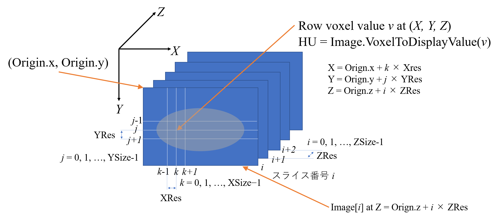
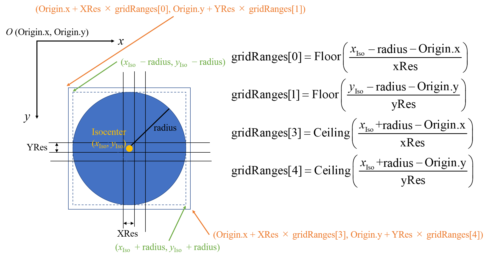

# 6.4 リファレンスポイントのHU値のチェック

## 目的
リファレンスポイント近傍のHU値が極端に小さな、もしくは大きな値になっていないかを確認する。
リファレンスポイントのまわりのある半径を持つ球に含まれるVoxelのHU値の平均を返す関数を実装する。
実装ではリファレンスポイントがアイソセンターである場合になっている。

## 必要な情報
プランで用いられている画像、
プランのアイソセンター、
画像座標の原点、グリッドサイズ、グリッド幅
VoxelのHU値

## 与えられている引数

`PlanSetup`クラスのインスタンス`planSetup`、
許容するHU値の下限値`HuLowerThreshold`、
許容するHU値の上限値`HuUpperThreshold`

## 必要な情報へのアクセス方法
- 現在開かれているプラン(`planSetup`)で用いられている画像の取得
  ```csharp
  var image = planSetup.StructureSet.Image;
  ```
- アイソセンター（一番目のビームのアイソセンター）の取得
  ```csharp
  var var isocenter = planSetup.Beams.First().IsocenterPosition;
  ```
- アイソセンターの座標の取得（1次元配列に格納）
  ```csharp
  var isocenterPosition = new double[] { isocenter.x, isocenter.y, isocenter.z };
  ```
- 画像座標の原点(`gridOrigin`)、グリッド幅（mm）(`gridReses`)、グリッドサイズ(`gridSizes`)の取得(それぞれ1次元配列に格納)
  ```csharp
  var gridOrigin = new double[] { image.Origin.x, image.Origin.y, image.Origin.z };
  var gridReses = new double[] { image.XRes, image.YRes, image.ZRes };
  var gridSizes = new int[] { image.XSize, image.YSize, image.ZSize };
  ```
- スライス`i`の画像の取得
  ```csharp
  image.GetVoxels(i, zImage);
  ```
  2次元配列`zImage`に画素値が格納される。1次元目がx方向、2次元目がy方向であることに注意。
- 画素値をHU値に変換
  ```csharp
  var value = image.VoxelToDisplayValue(zImage[k, j]);
  ```



## 必要な情報
- 画像IDの表示
    ```csharp
    MessageBox.Show(string.Format("Image ID: {0}", image.Id));
    ```
- 画像の グリッド情報
    ```csharp
    MessageBox.Show(string.Format("Origin (原点): ({0:0}, {1:0}, {2:0})", image.Origin.x, image.Origin.y, image.Origin.z));
    MessageBox.Show(string.Format("Resolution (グリッド幅): ({0:0}, {1:0}, {2:0})", image.XRes, image.YRes, image.ZRes));
    MessageBox.Show(string.Format("Size (グリッドサイズ): ({0:0}, {1:0}, {2:0})", image.XSize, image.YSize, image.ZSize));
    ```
- アイソセンタ情報
    ```csharp
    MessageBox.Show(string.Format("Isocenter: ({0:0}, {1:0}, {2:0})", isocenter.x, isocenter.y, isocenter.z));
    int k0 = (int)Math.Floor((isocenter.x - image.Origin.x) / image.XRes);
    int j0 = (int)Math.Floor((isocenter.y - image.Origin.y) / image.YRes);
    int i0 = (int)Math.Floor((isocenter.z - image.Origin.z) / image.ZRes);
    MessageBox.Show(string.Format("Isocenterのグリッド位置: ({0:0}, {1:0}, {2:0}", k0, j0, i0));
    ```
-  アイソセンタの画素値、HU値
    ```csharp
    var z0Image = new int[image.XSize, image.YSize];
    image.GetVoxels(i0, z0Image);
    var rawVoxelValue0 = z0Image[k0, j0];
    MessageBox.Show(string.Format("IsocenterのRaw Voxel値: ({0}", rawVoxelValue0));
    var huValue0 =image.VoxelToDisplayValue(rawVoxelValue0);
    MessageBox.Show(string.Format("IsocenterのHU値: ({0}", huValue0));
    ```

## 実装
- アイソセンタを中心とした球内のHU値の平均を計算し、許容範囲かどうかを判定し、結果を返す関数

  ```csharp
      public static string CheckIsocenterHu(PlanSetup planSetup, double HuLowerThreshold, double HuUpperThreshold)
              {
  ```
- アイソセンタ座標の取得
  ```csharp
                  var isocenter = planSetup.Beams.First().IsocenterPosition;
                  var isocenterPosition = new double[] { isocenter.x, isocenter.y, isocenter.z };
  ```
- 画像、及びその原点、グリッド幅、グリッド数の取得
  ```csharp
                  var image = planSetup.StructureSet.Image;
                  var gridOrigin = new double[] { image.Origin.x, image.Origin.y, image.Origin.z };
                  var gridReses = new double[] { image.XRes, image.YRes, image.ZRes };
                  var gridSizes = new int[] { image.XSize, image.YSize, image.ZSize };
  ```
- 調べる範囲を決める球の半径（mm）の指定
  ```csharp
                  // radius of the sphere ROI in mm
                  double radius = 5;
  ```
- 調べる範囲の球を含むvoxel範囲の取得
  ```csharp
                  var gridRanges = GetGridRangesForSphere(radius, isocenterPosition, gridOrigin, gridReses, gridSizes);
  ```
- 直方体内のvoxelを全て回るループ
  ```csharp
                  int numVoxels = 0;
                  double sum = 0;
                  var zImage = new int[image.XSize, image.YSize];
                  // Z
                  for (int i = gridRanges[2]; i <= gridRanges[5]; i++)
                  {
                      double z = image.Origin.z + i * image.ZRes;
                      image.GetVoxels(i, zImage);
                      // Y
                      for (int j = gridRanges[1]; j <= gridRanges[4]; j++)
                      {
                          double y = image.Origin.y + j * image.YRes;
                          // X
                          for (int k = gridRanges[0]; k <= gridRanges[3]; k++)
                          {
                              double x = image.Origin.x + k * image.XRes;
  ```
- voxelが球内に含まれるかを判定し、球外だと次のvoxelに移る。
    ```csharp

                                double r = Math.Sqrt(Math.Pow(isocenterPosition[0] - x, 2) + Math.Pow(isocenterPosition[1] - y, 2) + Math.Pow(isocenterPosition[2] - z, 2));
                                if (r > radius)
                                {
                                    continue;
                                }
    ```
- 球内のvoxelの値をHU値に変換し、voxelsに格納し、HU値の和を求めるための変数`sum`に加える。
  ```csharp
                              var value = image.VoxelToDisplayValue(zImage[k, j]);
                              sum += value;
                              numVoxels += 1;
                          }
                      }
                  }
  ```
- 球内のvoxel値の平均を計算し、結果を`result`に書き出し。
  ```csharp
                  var average = sum / numVoxels;
                  //MessageBox.Show(String.Format("numVoxels, sum, average: {0}, {1}, {2:0.0}", numVoxels, sum, average));
                  string result = String.Format("Averaged HU within the {0} mm sphere at Isocenter: {1:0.0}", radius, average);
                  
                  if (HuLowerThreshold < average && average < HuUpperThreshold)
                  {
                      return MakeFormatText(true, "Check Isocenter HU", "");
                  }
                  else
                  {
                      return MakeFormatText(false, "Check Isocenter HU", result);
                  }

              }
  ```
- 半径 radiusの球をぎりぎり含む直方体のVoxel範囲を返す補助関数
    ```csharp
    public static int[] GetGridRangesForSphere(double radius, double[] center, double[] gridOrigin, double[] gridReses, int[] gridSizes)
    {
        var xGridRanges = GetGridRange1d(radius, center[0], gridOrigin[0], gridReses[0], gridSizes[0]);
        var yGridRanges = GetGridRange1d(radius, center[1], gridOrigin[1], gridReses[1], gridSizes[1]);
        var zGridRanges = GetGridRange1d(radius, center[2], gridOrigin[2], gridReses[2], gridSizes[2]);

        var gridRanges = new int[6];

        gridRanges[0] = xGridRanges[0];
        gridRanges[1] = yGridRanges[0];
        gridRanges[2] = zGridRanges[0];
        gridRanges[3] = xGridRanges[1];
        gridRanges[4] = yGridRanges[1];
        gridRanges[5] = zGridRanges[1];

        return gridRanges;
    }

    public static int[] GetGridRange1d(double radius, double center, double origin, double res, int size)
    {
        var gridRanges = new int[2];

        gridRanges[0] = (int)Math.Floor(((center - radius) - origin) / res);
        if (gridRanges[0] < 0)
        {
            gridRanges[0] = 0;
        }
        gridRanges[1] = (int)Math.Ceiling(((center + radius) - origin) / res);
        if (gridRanges[1] >= size)
        {
            gridRanges[1] = size-1;
        }

        return gridRanges;
    }
    ```
    
    
