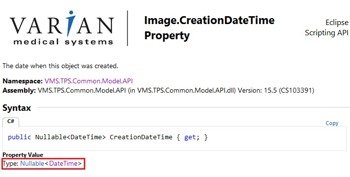

# 7.3 撮影日のチェック

## 目的

治療計画の線量計算に使用するCT画像が最新のものかチェックします。

## 必要な情報

CT画像の撮影(作成)日

## 与えられている引数

`PlanSetup`クラスのインスタンス`plan`

## 必要な情報へのアクセス方法

### 開いているプランのCT画像情報へのアクセス方法  

**VMS.TPS.Common.Model.API.Image** クラスを使用します。  

```csharp
Image image = plan.StructureSet.Image;
```

と定義すれば良いのですが、本ソースコードでは使用宣言している名前空間 **System.Windows.Controls** も **Image** クラスを持っており、**VMS.TPS.Common.Model.API.Image** なのか **System.Windows.Controls.Image** かを明示しなければ、あいまいな参照となってエラーが発生します。  
したがって、本ソースコードでは以下の様に明示的に定義する必要があります。  

```csharp
VMS.TPS.Common.Model.API.Image image = plan.StructureSet.Image;
```

画像の撮影（作成）日時に関する情報は**Image** クラスの **CreationDateTime** プロパティから、null許容型DateTime構造体として取得できることがヘルプで確認できます。



画像の撮影（作成）日時に関する情報を取得するには、以下の様に記述します。

```csharp
DateTime creationDateTime = image.CreationDateTime.Value;
```

### その他の画像情報へのアクセス方法

開いているプランに紐付けされていない画像にアクセスするには以下のように繰り返しステートメントを使って階層を辿ります。  
Patient -> Study -> Series -> Image

```csharp
var studies = plan.Course.Patient.Studies;
foreach (var study in studies)
{
    foreach (var series in study.Series)
    {
        foreach (var image in series.Images)
        {
            creationDateTime = image.CreationDateTime.Value;
        }
    }
}
```

## 必要な情報の表示

`Exercise_PlanCheck_Ex1.3.cs`を開き、関数 **CheckImageFunc** 内にコードを記述してみましょう。

```csharp
//画像の撮影（作成）日時の取得
DateTime imgDateTime = image.CreationDateTime.Value;

//日付部分のみを取得
DateTime imgDate = imgDateTime.Date;

//取得した日時および日付を表示
MessageBox.Show(string.Format("Creation Date & Time: {0}\nCreation Date only: {1}\n", imgDateTime, imgDate));
```

実際にEclipseでImage PropertyのHistoryタブを開き、日付を確認してみてください。


## 実装

治療計画の線量計算に使用しているCT画像が最新かどうか確認するには他画像の撮影（作成）された日付と比較します。
さらにQA用のファントム画像やCBCT画像などは比較対象から除外する必要があります。  

### QA(ファントム)画像の除外方法  

Verificationプラン作成時にコピーされたファントム(QA)画像のStudyコメントには"ARIA RadOnc Study"という記述があるため、このコメントがある場合は画像を比較対象から除外します。

```csharp
    if (study.Comment != "ARIA RadOnc Study")
    {
        ～～処理～～
    }
```

### CBCT画像の除外方法  

SeriesクラスのImagingDeviceIdプロパティには画像検査装置の名称が格納されていますが、On Board Imagerで撮影されたCBCT画像では空欄となるため、このプロパティが空欄の場合は画像を比較対象から除外します。

```csharp
 if (series.ImagingDeviceId != "")
    {
        ～～処理～～
    }
```

### 日付の比較  

DateTime構造体は日付以外に時刻情報も含むため、Dateプロパティを使用して日付情報のみを取得し、関係演算子を用いて比較します。

```csharp
//現在開いているプランのCT画像の撮影日時
datetime1 = image1.CreationDateTime.Value;
//比較対象のCT画像の撮影日時
datetime2 = image2.CreationDateTime.Value;

//関係演算子を使って比較し、プランのCT画像が新しい場合に処理を行う
if (datetime1.Date > datetime2.Date)
{
    ～～処理～～
}
```

`Exercise_PlanCheck_Ex1.3.cs`を開き、関数 **CheckImageFunc** 内の以下の部分のコメントを外し、その下にコードを記述します。 さきほどの確認用コードは消していただいて構いません。

```csharp
//checkName = "ImageDate";
```

記述するコードは以下の通りです。

```csharp
//Get open image creation date
DateTime cImgDateTime = image.CreationDateTime.Value;
DateTime datetime;
DateTime newestImgDate = cImgDateTime;
foreach (var study in plan.Course.Patient.Studies)
{
    // Exclude QA(phantom) images
    if (study.Comment != "ARIA RadOnc Study")
    {
        foreach (var series in study.Series)
        {
            // Exclude kVCBCT images
            if (series.ImagingDeviceId != "")
            {
                foreach (var im in series.Images)
                {
                    datetime = im.CreationDateTime.Value;
                    if (datetime.Date > cImgDateTime.Date)
                    {
                        newestImgDate = datetime;
                    }
                }
            }
        }
    }
}

if (newestImgDate.Date == cImgDateTime.Date)
{
    // If true, add text[O] to the string 
    oText += MakeFormatText(true, checkName, "");
}
else
{
    //If false, add the parameters and text[X] to the string
    oText += MakeFormatText(false, checkName, cImgDateTime.ToString("yyyyMMdd") + " --> newest:" +
    newestImgDate.ToString("yyyyMMdd"));
}
```
