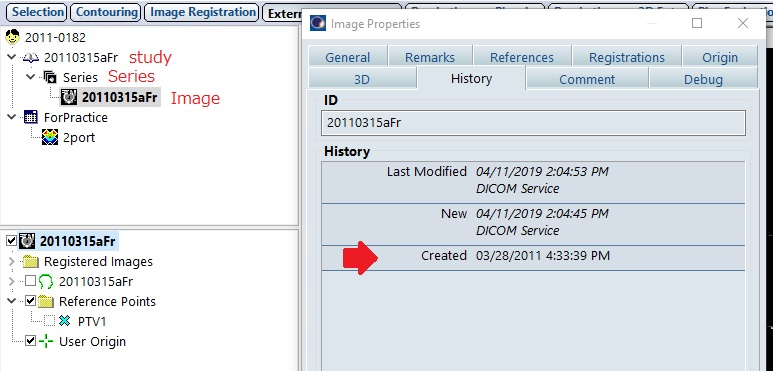

# 7.3 撮影日のチェック

## 目的

治療計画に使用するCT画像が最新のものかチェックします。

## 必要な情報

CT画像の撮影(作成)日

## 与えられている引数

`PlanSetup`クラスのインスタンス`plan`

## 必要な情報へのアクセス方法

現在開いているプランからCT画像情報へアクセスするには、以下のようにします。  

**VMS.TPS.Common.Model.API.Image**クラスを使用します。  

```csharp
Image image = plan.StructureSet.Image;
```

と定義すれば良いのですが、本ソースコードでは使用宣言している名前空間**System.Windows.Controls**も**Image**クラスを持っており、**VMS.TPS.Common.Model.API.Image**なのか**System.Windows.Controls.Image**かが明示しなければ、あいまいな参照に対するエラーが発生します。  
したがって、本ソースコードでは以下の様に明示的に定義します。  

```csharp
//治療計画に使用されている画像のImageクラスのインスタンスimageを取得
VMS.TPS.Common.Model.API.Image image = plan.StructureSet.Image;
```

画像の撮影（作成）日を取得するには**Image**クラスの**CreationDateTime**プロパティを使用します。  

```csharp
DateTime creationDateTime = image.CreationDateTime.Value;
```

## 実装

治療計画に使用しているCT画像が最新かどうか確認するには他画像と撮影日付を比較します。
さらに比較対象からはQA用のファントム画像やCBCT画像などを除外する必要があります。  

### 他画像情報を参照  
  
他の画像にアクセスするには以下のようにループを使って階層を辿ります。  
Patient -> Study -> Series -> Image

```csharp
var studies = plan.Course.Patient.Studies;
foreach (var study in studies)
{
    foreach (var series in study.Series)
    {
        foreach (var image in series.Images)
        {
            datetime = image.CreationDateTime.Value;
        }
    }
}
```

下記のEclipseの画面からも階層化されていることが確認できます。



### QA(ファントム)画像の除外方法  

Verificationプラン作成時にコピーされたファントム(QA)画像のStudyコメントには"ARIA RadOnc Study"という記述があるため、このコメントが無い画像を比較対象とします。

```csharp
    if (study.Comment != "ARIA RadOnc Study")
    {
        ～～処理～～
    }
```

### CBCT画像の除外方法  

SeriesクラスのImagingDeviceIdプロパティには画像検査装置の名称が格納されていますが、OBIで撮影されたCBCT画像では空欄となるため、このプロパティが空欄では無い画像を比較対象とします。

```csharp
 if (series.ImagingDeviceId != "")
    {
        ～～処理～～
    }
```

### 日付の比較 

日付を比較するには関係演算子を用います。
またDateTime構造体から年月日情報を取得するにはDateプロパティを使用します。

```csharp
//現在開いているプランのCT画像の撮影日時
datetime1 = image1.CreationDateTime.Value;
//比較対象のCT画像の撮影日時
datetime2 = image2.CreationDateTime.Value;

//関係演算子を使って比較し、プランのCT画像が新しい場合に処理を行う
if (datetime1.Date > datetime2.Date)
{
    ～～処理～～
}
```

演習用ソースコード「Exercise_PlanCheck_Ex1.3.cs」を開き、関数**CheckImageFunc**内の次の1行のコメントを解除します。

```csharp
//checkName = "ImageDate";
```

関数**CheckImageFunc**内の下記部分にコードを記述しましょう。  

```csharp
// Check imaging date of CT images
// CT images must be newest.
checkName = "ImageDate";

　～～以下にコードを記述～～
```

記述するコードは以下の通りです。

```csharp
//Get open image creation date
DateTime cImgDateTime = image.CreationDateTime.Value;
DateTime datetime;
DateTime newestImgDate = cImgDateTime;
foreach (var study in plan.Course.Patient.Studies)
{
    // Exclude QA(phantom) images
    if (study.Comment != "ARIA RadOnc Study")
    {
        foreach (var series in study.Series)
        {
            // Exclude kVCBCT images
            if (series.ImagingDeviceId != "")
            {
                foreach (var im in series.Images)
                {
                    datetime = im.CreationDateTime.Value;
                    if (datetime.Date > cImgDateTime.Date)
                    {
                        newestImgDate = datetime;
                    }
                }
            }
        }
    }
}

if (newestImgDate.Date == cImgDateTime.Date)
{
    // If true, add text[O] to the string 
    oText += MakeFormatText(true, checkName, "");
}
else
{
    //If false, add the parameters and text[X] to the string
    oText += MakeFormatText(false, checkName, cImgDateTime.ToString("yyyyMMdd") + " --> newest:" +
    newestImgDate.ToString("yyyyMMdd"));
}
```

MakeFormatText関数で整形された判定文が次のように返されます。  

- CT画像が最新の場合、      「ImageDate: O 」  
- CT画像が最新でない場合、   「ImageDate: (20190505 --> newest:20191202) X 」  
